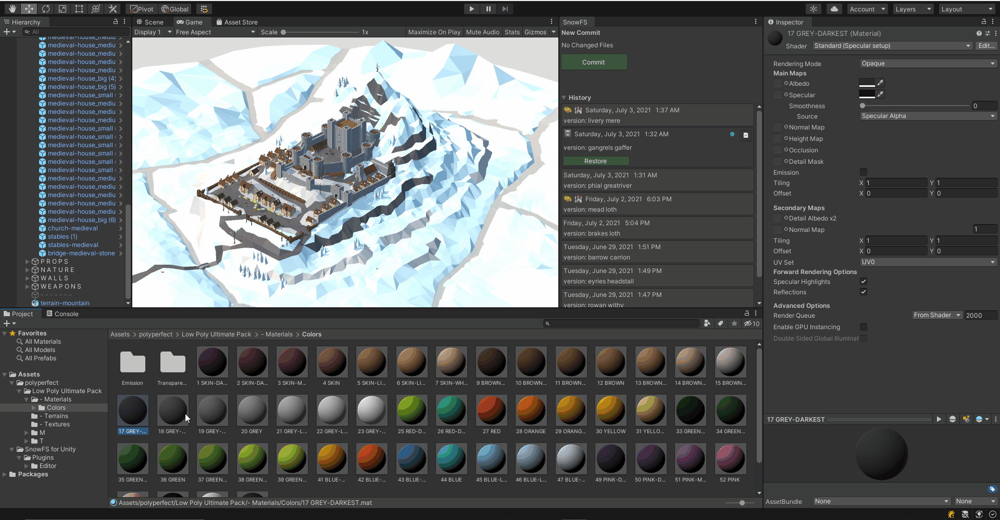

 Artwork by [Firman Hatibu](https://www.instagram.com/firmanhatibu/?hl=en)

# SnowFS for Unity - Easy local version control for the Unity Editor

## Summary

*SnowFS for Unity* is an integration of [SnowFS](https://github.com/Snowtrack/SnowFS) in the [Unity editor](https://unity.com/). SnowFS is a lightweight version control system for artists and designers with a focus on multimedia assets.

### What it is

*SnowFS for Unity* is a rapid versioning tool to save snapshots and rollback to earlier states. It is local-only versioning with a focus on increasing single-user iterations. It is heavily inspired by git and strips away the most confusing parts.

### What it is not

- *SnowFS for Unity* is not a collaboration tool.
- *SnowFS for Unity* has no cloud storage features.
- *SnowFS for Unity* has no features of merging branches.

## Installation

You can grab get the latest source code by cloning this repository and copy paste the content of the `Assets` directory into your project. Alternatively you can get the latest release from the [releases page](https://github.com/daniellanner/snowfs-for-unity/releases). Releases are compiled for all supported *Unity* versions.

### Supported Unity Versions

- Unity 2018.4 LTS
- Unity 2019.4 LTS
- Unity 2020.3 LTS

### Supported Platforms

- Windows
- MacOS
- Linux

### Collisions

*SnowFS for Unity* is built using [Newtonsoft.Json for Unity](https://github.com/jilleJr/Newtonsoft.Json-for-Unity) and the package is included in this repository at `Snow/Plugins/Editor/libs`. There is no need to import the directory should you already have a Newtonsoft.Json distribution present within your project.

## Documentation

For a detailed documentation on how to work with *SnowFS for Unity* see the [`docs/`](docs/) directory. Among other things the documentation will help you [Getting Started](docs/getting-started.md), demonstrate an [Example Workflow](docs/example-workflow.md) and discuss [Advanced Features](docs/advanced-features.md).

## FAQ

See the dedicated [FAQ](docs/faq.md) section in the [`docs/`](docs/) directory.

  - [What is *SnowFS for Unity*?](docs/faq.md#what-is-snowfs-for-unity)
  - [What exactly is *SnowFS*?](docs/faq.md#what-exactly-is-snowfs)
  - [How does it work?](docs/faq.md#how-does-it-work)
  - [Why not git or p4?](docs/faq.md#why-not-git-or-p4)
  - [I heard git had branching and merging. Can I merge branches in *SnowFS*?](docs/faq.md#i-heard-git-had-branching-and-merging-can-i-merge-branches-in-snowfs)
  - [Does *SnowFS for Unity* have remote backup features?](docs/faq.md#does-snowfs-for-unity-have-remote-backup-features)
  - [Can I share the versions created with *SnowFS for Unity* with others?](docs/faq.md#can-i-share-the-versions-created-with-snowfs-for-unity-with-others)
  - [Can I use *SnowFS for Unity* with other version control tools?](docs/faq.md#can-i-use-snowfs-for-unity-with-other-version-control-tools)

## Contribute

Check the [issues](https://github.com/daniellanner/snowfs-for-unity/issues) if your desired changes are already being worked on or open an issue before starting to work on any changes. Follow the [contribution guidelines](CONTRIBUTING.md) on how to integrate your changes.

## Versioning

Starting with version 1.0.0 *SnowFS for Unity* follows the [semantic versioning](http://semver.org/)
scheme. The API change and backward compatibility rules are those indicated by
SemVer.

## Built With :heart:

### Tools :hammer_and_wrench:

- [SnowFS](https://github.com/Snowtrack/SnowFS)
- [Newtonsoft.Json for Unity](https://github.com/jilleJr/Newtonsoft.Json-for-Unity)

### Automation :robot:

- [Create Unity Package](https://github.com/pCYSl5EDgo/create-unitypackage)
- [Github Changelog Generator](https://github.com/github-changelog-generator/github-changelog-generator)

### Utilities :gear:

- [VSCode Unity Debug](https://github.com/Unity-Technologies/vscode-unity-debug)
- [Editorconfig VSCode](https://github.com/editorconfig/editorconfig-vscode)
- [VSCode Unity Code Snippets](https://github.com/kleber-swf/vscode-unity-code-snippets)

## Licensing

*SnowFS for Unity* is licensed under the **MIT** license, please review the [LICENSE file](LICENSE). Excluded from the license are images, artworks, and logos.

### External projects
- [SnowFS](https://github.com/Snowtrack/SnowFS/) is licensed under the **MIT** license, please review the [LICENSE file](https://github.com/Snowtrack/SnowFS/blob/main/LICENSE). Excluded from the license are images, artworks, and logos.
- [Newtonsoft.Json for Unity](https://github.com/jilleJr/Newtonsoft.Json-for-Unity) is licensed under the **MIT** license, please review the [LICENSE file](https://github.com/jilleJr/Newtonsoft.Json-for-Unity/blob/master/LICENSE.md)

## Get in touch

Join the official [Snowtrack Discord Server](https://discord.gg/RDKPuH8dkA) for more information on [Snowtrack](https://snowtrack.io/), [SnowFS](https://github.com/Snowtrack/SnowFS), [SnowFS for Unity](https://github.com/daniellanner/snowfs-for-unity), and future plugins.
