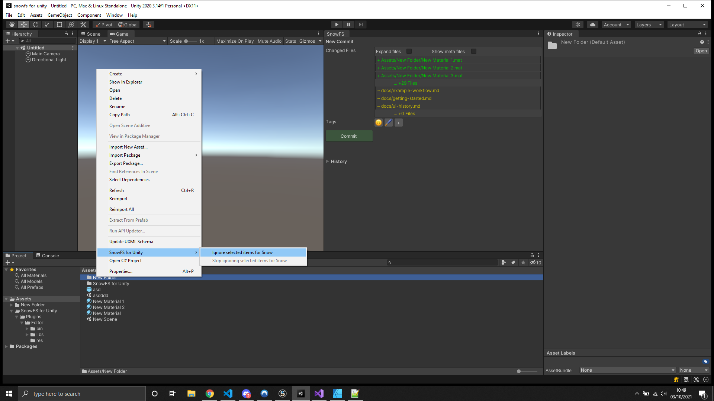

 Artwork by [Firman Hatibu](https://www.instagram.com/firmanhatibu/?hl=en)

# SnowFS for Unity - Advanced Features

> ❗ ***Disclaimer** This project is in alpha state and is being actively developed. Do not use this project in a production environment and without backups of your data.* ❗

- [SnowFS for Unity - Advanced Features](#snowfs-for-unity---advanced-features)
  - [Ignore Files](#ignore-files)
  - [Autosave](#autosave)
  - [Automatic Branching](#automatic-branching)
  - [Compatability with other version control tools](#compatability-with-other-version-control-tools)

## Ignore Files

For workflow, memory or performance reasons you might not want to track all the files in your project. To ignore files select them in your *Project* window and right-click. Select **SnowFS for Unity/Ignore selected items for Snow** to ignore the selected directory and/or file. To undo this action, select the same item and click **SnowFS for Unity/Stop ignoring selected items for Snow**.

Alternatively, to ignore files add them to the hidden `.snowignore` file in the root directory of your project. For more information on the ignore files visit the official Snowtrack documentation. If you are familiar with git, `.snowignore` follows the same pattern matching as `.gitignore`.

## Autosave

To enable the autosave feature check the box within the **New Commit** window. Next to the toggle you may set the interval of the autosaves in minutes. The amount is clamped between 5 minutes and 60 minutes. The autosave is triggered anytime a file is saved.

## Automatic Branching

SnowFS for Unity takes care of automatic branching and switching between branches. This keeps the history of all work clean without any manual labour on the users part.

This changes nothing of the user experience of the Unity plugin but increases compatability with Snowtrack and other SnowFS projects.

## Compatability with other version control tools

SnowFS for Unity does not replace your teams current collaboration tool. This plugin supports artists and designers to avoid overly complicated technical workflows of established version control tools for **local development only**.

SnowFS for Unity works uses a `.snow` repository in the root directory of your project. Per default this hidden directory is not tracked by git or p4 repositories. This enables you to rapidly iterate on your ideas locally until you are ready to submit with your teams collaboration tool.

---

Back to [`docs`](../docs)
