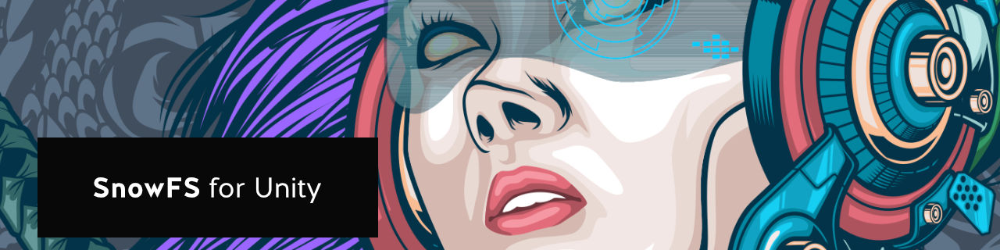
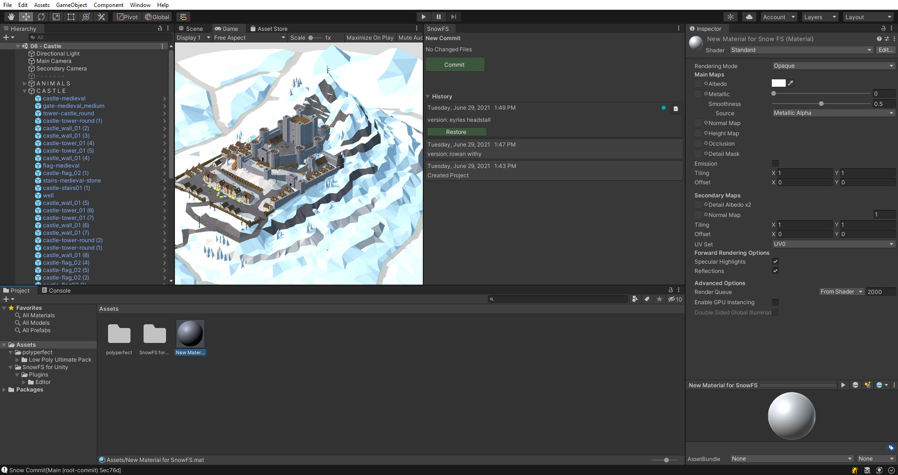
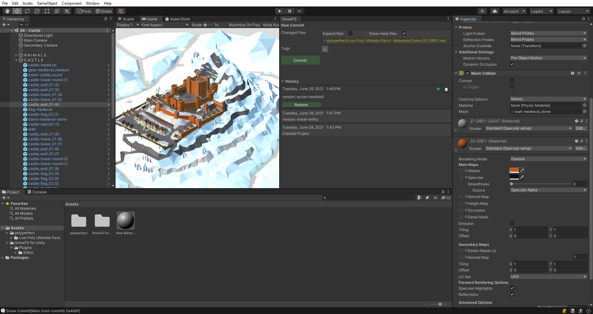
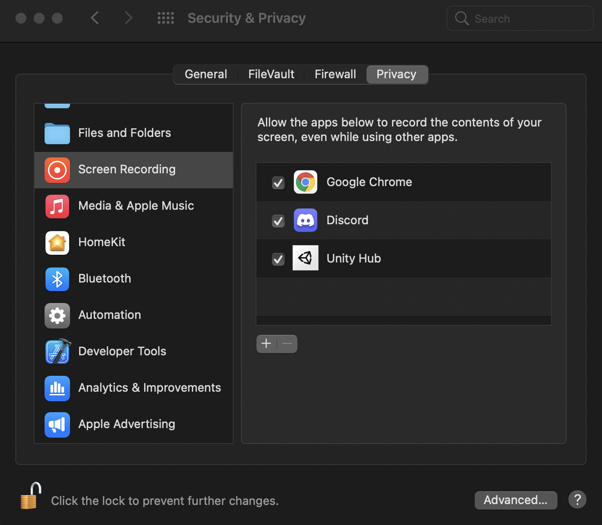
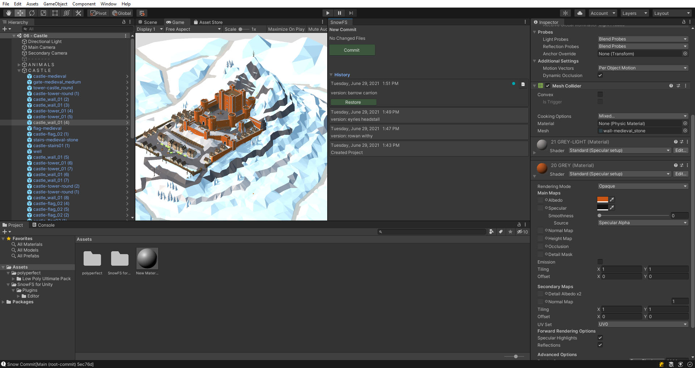
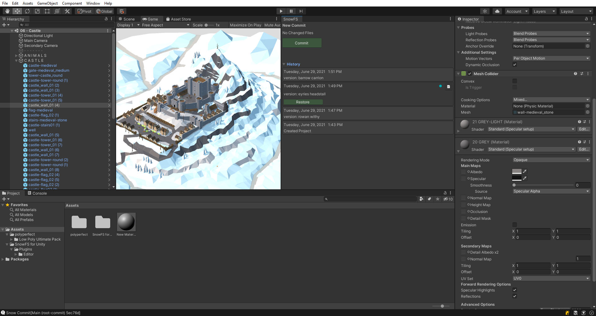

 Artwork by [Firman Hatibu](https://www.instagram.com/firmanhatibu/?hl=en)

# SnowFS for Unity - Example Workflow

> ❗ ***Disclaimer** This project is in alpha state and is being actively developed. Do not use this project in a production environment and without backups of your data.* ❗

- [SnowFS for Unity - Example Workflow](#snowfs-for-unity---example-workflow)
  - [Iteration without data loss](#iteration-without-data-loss)
  - [Modify a file](#modify-a-file)
  - [Commit](#commit)
  - [Restore previous commit](#restore-previous-commit)
  - [Continue working](#continue-working)

## Iteration without data loss

*SnowFS for Unity* is a tool to speed up the iteration process and experiment frequently and freely without any fear of loss of progress or data.

In this example we will go over the primarily iteration loop on how to create and restore versions of your project. We are working on a Unity scene containing a castle and as shown in the image below our version history is currently made up of three commits and we have no changed files.

## Modify a file

We are unhappy with the color of our castle walls and decide to go for something more exotic. In a fit of madness we convince ourselves that what our castle really needs is a splash of orange.

As soon as we save the new diffuse color, the material is added to the *Changed Files* section of SnowFS. Since we modified the file, it is rendered with a yellow color (more about this in the section [New Commit](#new-commit-window-section)).

## Commit

By clicking on the green *Commit* button we add this version to our history.

> If you are working on a Mac and this is your first commit, you might see a pop-up about allowing Unity to record the contents of your screen.
>
> *SnowFS for Unity* creates screenshots for each commit. In order to enable this feature you must add Unity (and maybe Hub) to the list of enabled applications. You may edit the list by unlocking the icon on the bottom left
>
> 
>

The version has been automatically titled as *"version: barrow carrion"*. This is our current state of the project as indicated by the blue dot on the right side of the history panel (more about this in the section [History](#history-window-section)).

## Restore previous commit

We now come to our senses and realize that an orange castle is a terrible idea. Nonetheless, we do not want to lose our progress and might want to come back to this insanity at a future point.

For now let's return to the more conservative approach of having grey stones. In order to do that we browse for the version we want to restore and select it. This will show a green button titled *Restore*. We click it.

## Continue working

Our files have now been restored to the state they were when we created the selected version. We can now carry on working from this state and add further changes and commits. Naturally we can at any time restore the orange castle by selecting *version: barrow carrion* and restoring it.

---

Back to [`docs`](../docs)
