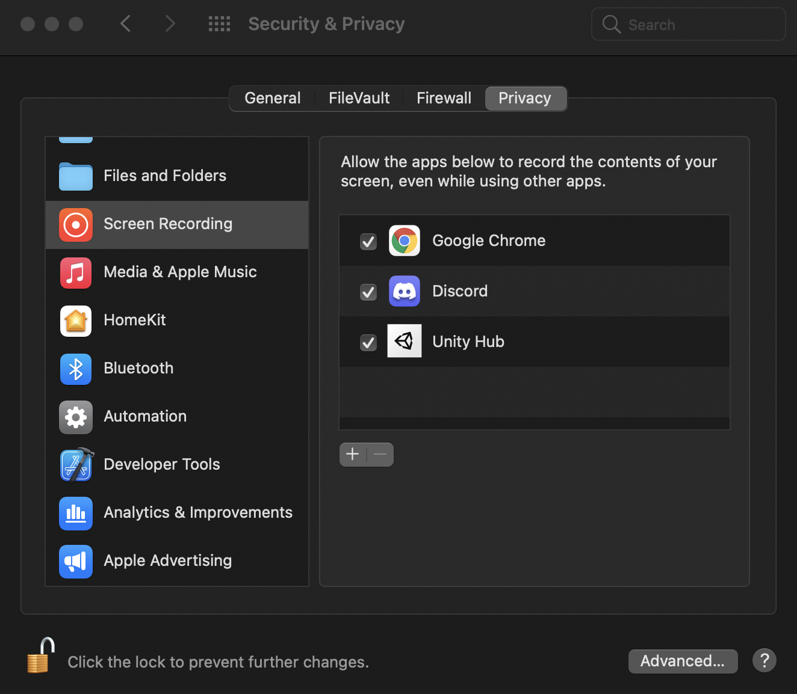

 Artwork by [Firman Hatibu](https://www.instagram.com/firmanhatibu/?hl=en)

# SnowFS for Unity - Getting Started

> ❗ ***Disclaimer** This project is in alpha state and is being actively developed. Do not use this project in a production environment and without backups of your data.* ❗

- [SnowFS for Unity - Getting Started](#snowfs-for-unity---getting-started)
  - [Creating a repository](#creating-a-repository)
  - [Onboarding](#onboarding)

## Creating a repository

Open the SnowFS window at *Window/SnowFS for Unity*.

On first start-up you will be welcomed by the *Initialize Window*. This window offers two buttons leading you to the documentation or the discord server. To continue with creating a repository for your project click on the prominent black *Initialize SnowFS* button. This will begin the onboarding process.

## Onboarding

Depending on the project size, the onboarding may take up to a minute (~60 seconds for 15k files on a HDD). You can follow the status of the operations via the onboarding window.

The window will accompany you through the following steps.

- **Initialize Repository** SnowFS for Unity creates a `.snow` repository in the root directory of your project.
- **Browsing through files to add** SnowFS for Unity is browsing over the files in the project directory and staging them to be tracked by the plugin.
- **Creating initial commit of project** After the initial staging all files are now committed to the version control and the initial state of your project has been created.

> If you are working on a Mac and this is your first time initializing a project, you might see a pop-up about allowing Unity to record the contents of your screen.
>
> *SnowFS for Unity* creates screenshots for each commit. In order to enable this feature you must add Unity (and maybe Hub) to the list of enabled applications. You may edit the list by unlocking the icon on the bottom left
>
> 
>

After all steps have been completed you can exit the onboarding process by clicking the *Start working* button.

See the [example workflow](example-workflow.md) for next steps.

---

Back to [`docs`](../docs)
