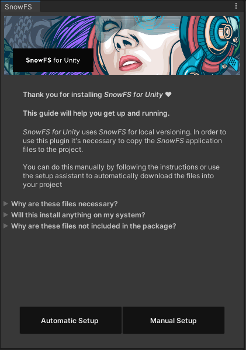
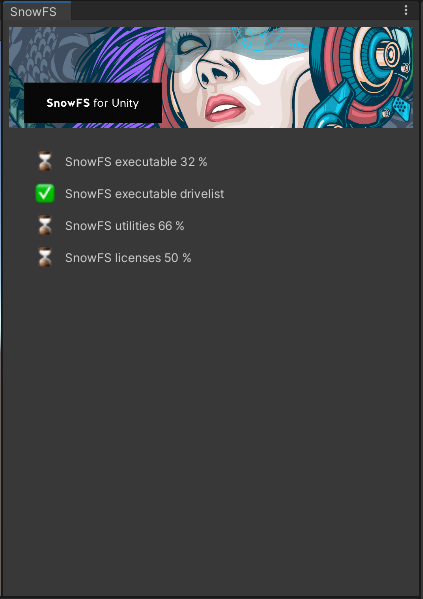
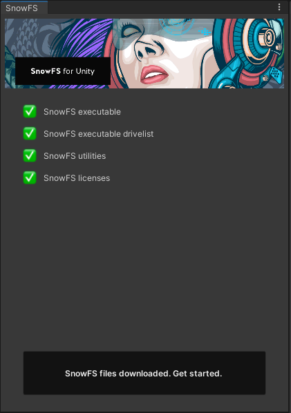
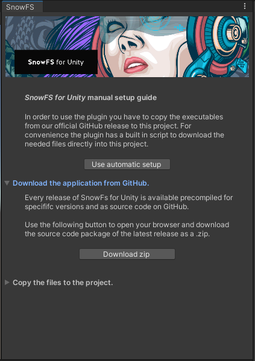

 Artwork by [Firman Hatibu](https://www.instagram.com/firmanhatibu/?hl=en)

# SnowFS for Unity - Installation

> ❗ ***Disclaimer** This project is in alpha state and is being actively developed. Do not use this project in a production environment and without backups of your data.* ❗

- [SnowFS for Unity - Installation](#snowfs-for-unity---installation)
  - [Download from Github](#download-from-github)
  - [Download from the Asset Store](#download-from-the-asset-store)
    - [Setup SnowFS](#setup-snowfs)
      - [Automatic Setup](#automatic-setup)
      - [Manual Setup](#manual-setup)
  - [Final Package Layout](#final-package-layout)

## Download from Github

Download the latest [release from Github](https://github.com/daniellanner/snowfs-for-unity/releases). Releases are packed as `.unitypackage`. To minimize compile times in your project **SnowFS for Unity** is also available as a pre-compiled package for individual Unity versions.

Import the package by dragging the downloaded package into an open Unity Editor *Project window*.

## Download from the Asset Store

Open the Unity Asset Store within your Unity Editor. Download and import the plugin from the [SnowFS for Unity Asset Store page](#) (coming soon).

### Setup SnowFS

Unity disallows the distribution of executable files through the Asset Store. From the Unity Asset Store submission Guidelines:

> The package must not contain an .exe or installer program or application. If your plugin requires an external program to run, please remove the installer program from your package and write the instructions on how to download and install the installer program in your documentation.
([Asset Store Submission Guideline](https://unity3d.com/asset-store/sell-assets/submission-guidelines), Section 1.2.f)

*SnowFS for Unity* therefore offers a setup guide on how to copy the needed files into the project and get you started.



#### Automatic Setup

For convenience *SnowFS for Unity* has a built in file download to get you started. Click the *Automatic Setup* button in the setup guide. This will download the necessary files directly into your project.



Note that this will not install any software or application on your system. All this does is download the files from the GitHub repository directly to the correct location in your project.



When all downloads have completed a button will prompt you to [Get Started](getting-started.md).

#### Manual Setup

Follow the instructions of the setup window.



Download the latest .zip from the GitHub repository by clicking the button labeled *Download zip*. This will open your preferred browser and download the latest release into your downloads folder.

Extract the zip file and copy the contents of the `bin` folder to your project. The setup window offers a button to open the location in the project in your file explorer.

When the files have been successfully imported in the right location a button will prompt you to [Get Started](getting-started.md).

## Final Package Layout

Finally, your plugin layout should look like this:

```txt
- SnowFS for Unity
  - Plugins
    - Editor
      - bin
        - linux
          - Linux SnowFS distribution
        - macos
          - MacOS SnowFS distribution
        - win
          - Windows SnowFS distribution
      - libs
        - external library dependencies
      - res
        - raw data and resources
      - Source code
```

---

Back to [`docs`](../docs)
