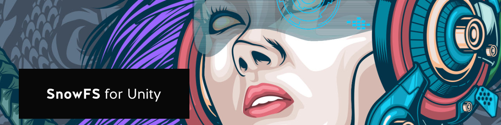
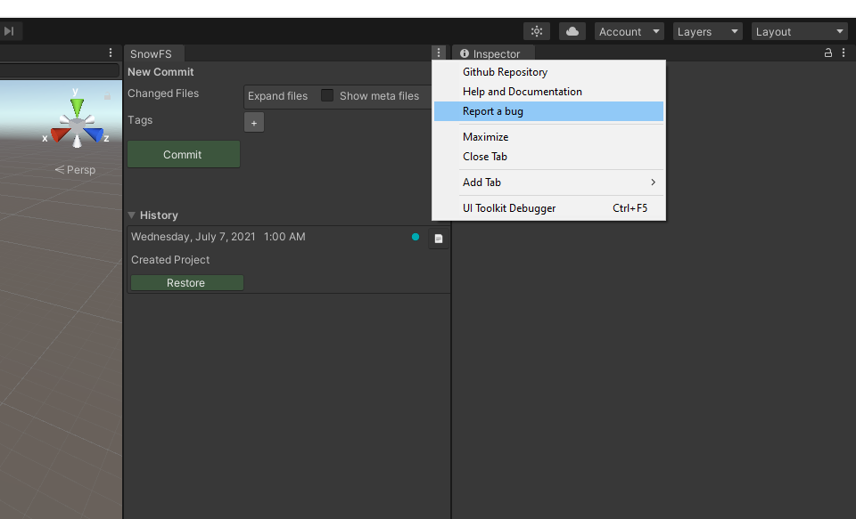

 Artwork by [Firman Hatibu](https://www.instagram.com/firmanhatibu/?hl=en)

# SnowFS for Unity - Getting Started

> ❗ ***Disclaimer** This project is in alpha state and is being actively developed. Do not use this project in a production environment and without backups of your data.* ❗

- [SnowFS for Unity - Getting Started](#snowfs-for-unity---getting-started)
  - [Report a bug](#report-a-bug)
    - [Report via Github](#report-via-github)
    - [Report via bug report tool](#report-via-bug-report-tool)
  - [Get in touch](#get-in-touch)
  - [Built with](#built-with)
  - [License](#license)
  - [Important links](#important-links)

## Report a bug

There are two options on how to report a bug, depending if you have a Github account.

### Report via Github

Should you encounter a bug or have a feature request please open a issue on the SnowFS for Unity [Github repository](https://github.com/daniellanner/snowfs-for-unity/issues). Please read through open issues first to see if your problem has already been reported and follow the guidelines on how to report issues.

If you find an Issue that addresses the problem you're having, please add your own information to the existing issue rather than creating a new one. Adding a [reaction](https://github.blog/2016-03-10-add-reactions-to-pull-requests-issues-and-comments/) can also help be indicating to our maintainers that a particular problem is affecting more than just the reporter. 

### Report via bug report tool 

If you have no Github account, we still value your input :bug::heart:. You can use the *SnowFS bug report tool* by selecting *Report a bug* in the extended menu of the editor window.

This will open the bug report tool.

Please read through open issues first to see if your problem has already been reported and follow the guidelines on how to report issues. After verifying that your issues has not yet been reported, enter the information in the designated fields by following the suggestions.

To add more context to your report you may choose to share your logfile. Since log files may sometimes contain sensitive information the report tool offers a **Find and Replace** option.

Submitting your problem will publish it on the [Github issues page](https://github.com/daniellanner/snowfs-for-unity/issues).

## Get in touch

SnowFS for Unity is a community effort. Should you have ideas, questions or comments join the official [Snowtrack Discord Server](https://discord.gg/RDKPuH8dkA) on all things [Snowtrack](https://snowtrack.io/), [SnowFS](https://github.com/Snowtrack/SnowFS), [SnowFS for Unity](https://github.com/daniellanner/snowfs-for-unity), and future plugins.

## Built with

*SnowFS for Unity* is an open-source project only made possible thanks to open-source contributions by amazing people :heart:. This project is built with love, sweat, beer and code from the following projects:

- [SnowFS](https://github.com/Snowtrack/SnowFS)
- [Newtonsoft.Json for Unity](https://github.com/jilleJr/Newtonsoft.Json-for-Unity)
- [Create Unity Package](https://github.com/pCYSl5EDgo/create-unitypackage)
- [Github Changelog Generator](https://github.com/github-changelog-generator/github-changelog-generator)

## License

**SnowFS for Unity** is licensed under the **MIT** license, please review the [LICENSE file](LICENSE). Excluded from the license are images, artworks, and logos.

## Important links

- [*SnowFS for Unity* Github Repository](https://github.com/daniellanner/snowfs-for-unity)
- [*SnowFS for Unity* Issue Tracker](https://github.com/daniellanner/snowfs-for-unity/issues)
- [*SnowFS for Unity* Documentation](https://github.com/daniellanner/snowfs-for-unity/docs/get-started.md)
- [*SnowFS* Github Repository](https://github.com/Snowtrack/SnowFS)
- [*Snowtrack* Documentation](https://snowtrack.io/docs/)
- [Discord Server](https://discord.gg/RDKPuH8dkA)

---

Back to [`docs`](../docs)
