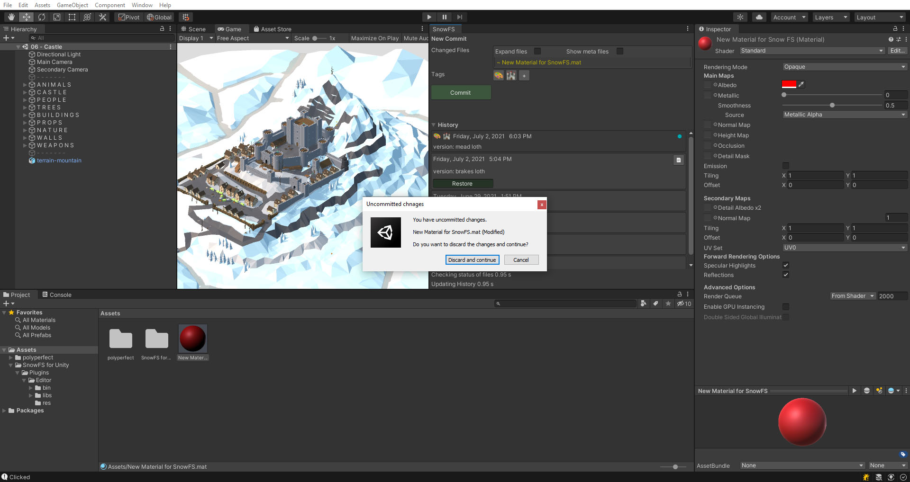

 Artwork by [Firman Hatibu](https://www.instagram.com/firmanhatibu/?hl=en)

# SnowFS for Unity - UI: History Panel

> ❗ ***Disclaimer** This project is in alpha state and is being actively developed. Do not use this project in a production environment and without backups of your data.* ❗

- [SnowFS for Unity - UI: History Panel](#snowfs-for-unity---ui-history-panel)
  - [List of versions](#list-of-versions)
  - [Changed files of commit](#changed-files-of-commit)
  - [Edit names of your commits](#edit-names-of-your-commits)
  - [Unsaved changes](#unsaved-changes)

## List of versions

The Unity for SnowFS window contains the expandable section *History* which displays all your commits. Select a commit by clicking on it. Selecting a commit displays further information and a button labeled *Restore*. Click the button to restore the selected version.

Each version entry is accompanied by a thumbnail of the last active scene window when the version was created. If no thumbnail is currently available a default thumbnail is displayed.

The currently active version is indicated by a darker shade of background color and a blue dot on the right hand side of the version panel.

## Changed files of commit

Currently there is no way to see the files that were changed in the specific version. This is in active development and will be released in the very near future.

## Edit names of your commits

You can update the name of your commit via clicking the button on the right of the selected commit and choose *Edit Name* in the context menu. (**NOTE** Currently there is no way to change the name of your commit. This is in active development and will be released in the very near future.)

## Unsaved changes

Should you have any unsaved changes in your workspace when restoring a commit, you may choose to discard or save the changes via a pop-up window.

Upon successfully discarding or saving your changes, SnowFS for Unity will then restore the requested version

---

Back to [`docs`](../docs)
