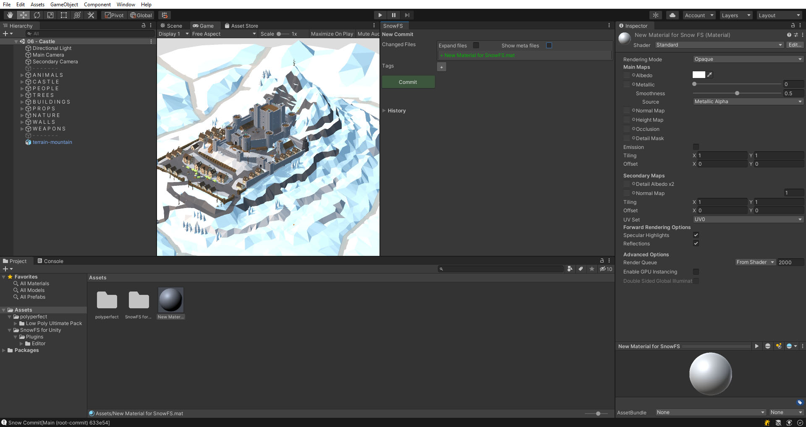
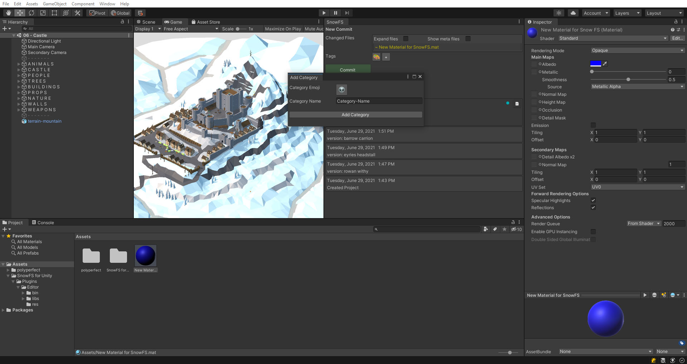
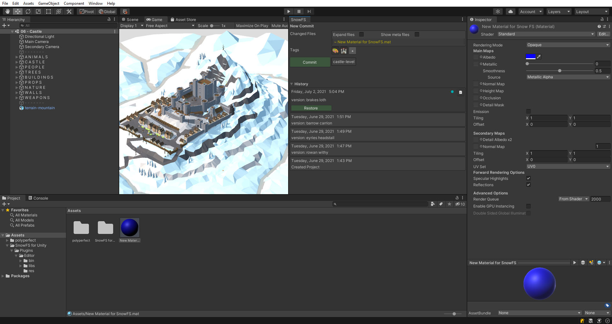

 Artwork by [Firman Hatibu](https://www.instagram.com/firmanhatibu/?hl=en)

# SnowFS for Unity - UI: New Commit Panel

> ❗ ***Disclaimer** This project is in alpha state and is being actively developed. Do not use this project in a production environment and without backups of your data.* ❗

- [SnowFS for Unity - UI: New Commit Panel](#snowfs-for-unity---ui-new-commit-panel)
  - [New Commit window section](#new-commit-window-section)
  - [Changed Files](#changed-files)
  - [Show .meta files](#show-meta-files)
  - [Tags](#tags)
    - [Add a new tag](#add-a-new-tag)
    - [Commit with tag](#commit-with-tag)
  - [Naming your commits](#naming-your-commits)

## New Commit window section

SnowFS for Unity tracks changes to files within the *Assets* directory of the Unity Project. Modifying files prompts them to appear within the *New Commit* section of the SnowFS window.

## Changed Files

Changed files are listed on the top of the window and rendered color coded.

-  Green means the file has been newly added.
-  Yellow means the file was modified.
-  Red means the file was deleted

Clicking on the files displayed in this section will select them in the Unity *Project* window and show their properties in the *Inspector*.

## Show .meta files

By default the view shows only a limited amount of files. By toggling *Show .meta files* you can choose whether do display the .meta files in the file list. Given that all files in the Unity project have a .meta counterpart, this information is a little redundant. Meta files are committed to the version regardless of this display option.

*Expand files* can be toggled to display all files in a change. In especially large changes, rendering the names of all files can be a hit on performance.

## Tags

SnowFS for Unity allows you to tag your commits with emojis. Tags are a helpful feature to easily categorize the nature of the changes you committed.

### Add a new tag

As we can see on the below image we already have a tag called "material-color" with the :art: emoji. We can add an amoji category by clicking on the *Create new Category* button above the *Commit* button.

This will prompt a windows to name your new category and assign an emoji. Currently this is populated with the default values :alien: and "Category-Name".

Click on the button with the emoji to open a new window to filter and select a fitting emoji. In the below example we search for an emoji containing the term "castle" and select :european_castle:.

Give the categroy a name via the text field. We go for "castle-level" and then add it to your pool by clicking *Add Category*.

### Commit with tag

Before committing you can toggle all the tags you want to associate with the commit. Additionally to the tag  :european_castle: we created before, we also toggle the :art: tag since we are changing some material properties.

These tags appear in the commit history view and helps organize commits. We can now distinctly determine that our latest commit is related to the castle level and has something to do with material colors.

> Missing feature: There is currently no way to actively filter for tags in the history view.

## Naming your commits

Per default the commits are titled via a Lord of the Rings wordlist. You can change the title of your commit in the *History* section of the SnowFS for Unity window via the context menu.

---

Back to [`docs`](../docs)
